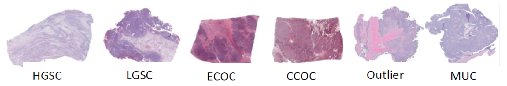
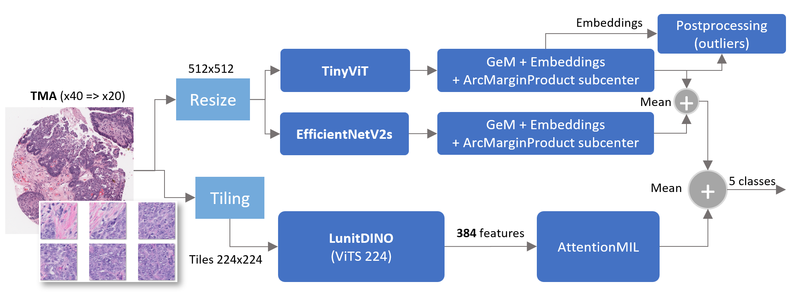
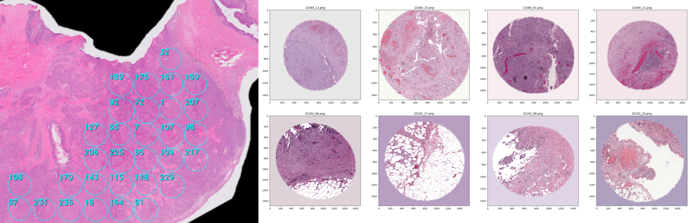
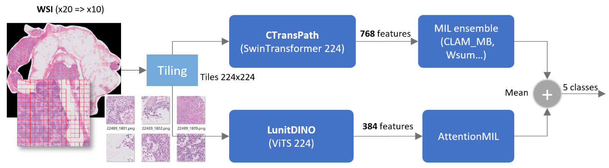

# Ovarian Cancer Classification

Ovarian carcinoma is the deadliest cancer of the female reproductive system. It has five common subtypes: high-grade serous carcinoma (HGSC), clear-cell ovarian carcinoma (CCOC), endometrioid (ECOC), low-grade serous (LGSC), and mucinous carcinoma (MUC). Additionally, several rare subtypes ("outliers") exist, each with distinct cellular morphology, etiology, molecular and genetic profiles, and clinical characteristics. Subtype-specific treatments are becoming more important, but accurate subtype identification remains a challenge.

We have two categories of images:
 - WSI (whole slide images): Large images (x20 magnification)
 - TMA (tissue microarray): Small images (x40 magnification)

## TMA
TMA models were trained using ArcFace loss and an ArcMarginProduct sub-center module to maximize class-wise separation in the embedding space. This approach enables outlier detection based on similarity distance. Since we lacked reliable samples of real outliers or rare classes, we fine-tuned the distance threshold using the public leaderboard. The Faiss package was used to identify nearest neighbors.

**TMA training pipeline overview**:

The dataset included only 25 TMA samples, that's why we generated/simulated additional TMA samples using the WSI provided in the training set.
The method selects random ellipses within a WSI based on a provided tumor mask, a generated OTSU mask, or randomly when no mask is available. TMA samples are generated at 20x magnification from WSI without downscaling.
The TMA simulator, built with Albumentations, crops a random ellipse from a given tile, adds noise to the contours, and applies a randomized background color.

Tile selection follows these constraints:

- Tiles with a high uniform color (including black) are discarded.
- Tiles must contain some tissue or tumor above a minimum ratio.
- Selected tiles must be square, with side lengths of 1482, 1568, or 1694 pixels.
- If any black (border) pixels are present, they are replaced with white.

Finally, the following stain/color augmentations are randomly applied to the TMA samples:
- Vahadane (using some TMA references)
- Macenko (with a generic reference)
- Reinhard (using some TMA references) 

Generated TMA has been reviewed to assess whether or not they should be considered for the training.

## WSI training pipeline overview:

Two features extractors from foundation models are applied:
- [LunitDINO ViTS](https://github.com/lunit-io/benchmark-ssl-pathology). It provides 768 features from 224x224 tiles.
- [CTransPath](https://github.com/Xiyue-Wang/TransPath). It provides 384 features from 224x224 tiles.
They are followed by a Multiple Instance Learning (MIL) module such as AttentionMIL to provide per image prediction.

## Notebooks
- [tma-generator-from-wsi.ipynb](https://github.com/LSWRD/Ovarian-Cancer-Classification/blob/main/tma-generator-from-wsi.ipynb): TMA generation from WSI images.
- [model-tma-arcface.ipynb](https://github.com/LSWRD/Ovarian-Cancer-Classification/blob/main/model-tma-arcface.ipynb): EfficientNet/TinyVit + Arcface training.
- [model-tma-mil.ipynb](https://github.com/LSWRD/Ovarian-Cancer-Classification/blob/main/model-tma-mil.ipynb): LunitDINO + AttentionMIL training.

## Data
- [Download dataset](https://www.kaggle.com/competitions/UBC-OCEAN/data) (794GB)
  (25 TMA images, 513 WSI images)

## References
- (1) Asadi-Aghbolaghi, M.; Farahani, H.; Zhang, A.; Akbari, A.; Kim, S.; Chow, A.; Dane, S.; Consortium, O. C.; Consortium, O.; Huntsman, D. G.; Gilks, C. B.; Ramus, S.; Köbel, M.; Karnezis, A. N.; Bashashati, A. Machine Learning-Driven Histotype Diagnosis of Ovarian Carcinoma: Insights from the OCEAN AI Challenge. medRxiv2024. https://doi.org/10.1101/2024.04.19.24306099.
- (2) Farahani, H.; Boschman, J.; Farnell, D.; Darbandsari, A.; Zhang, A.; Ahmadvand, P.; Jones, S. J.; Huntsman, D.; Köbel, M.; Gilks, C. B.; Singh, N.; Bashashati, A. Deep Learning-Based Histotype Diagnosis of Ovarian Carcinoma Whole-Slide Pathology Images. Modern Pathology 2022, 35 (12), 1983–1990.
- (3) Wölflein, G., Ferber, D., Meneghetti, A. R., El Nahhas, O. S. M., Truhn, D., Carrero, Z. I., Harrison, D. J., Arandjelović, O., & Kather, J. N. (2023). A good feature extractor is all you need for weakly supervised pathology slide classification. [arXiv:2311.11772](https://arxiv.org/abs/2311.11772v5).

